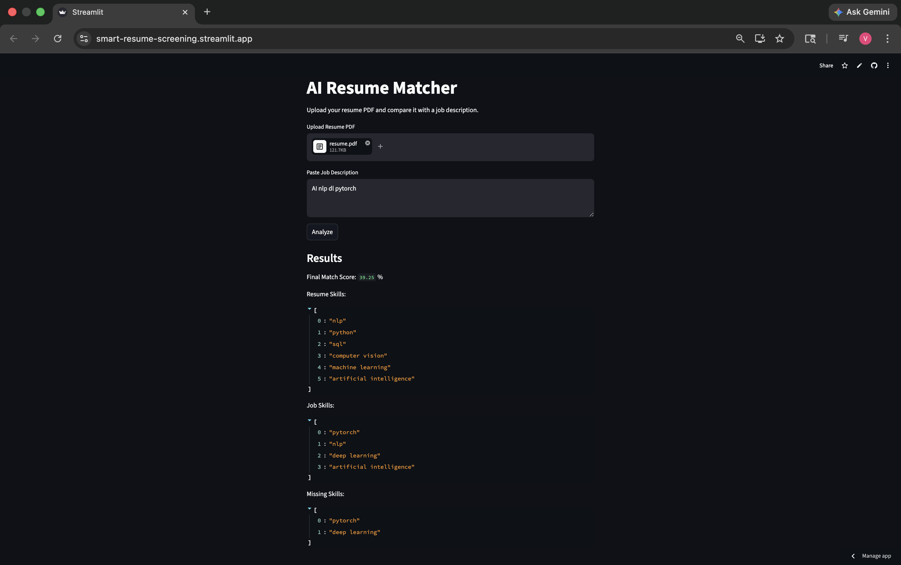

# AI Resume Matcher

A resume–job description matching system that evaluates candidate suitability using NLP-based semantic similarity and skill-based scoring.

The system combines Sentence-BERT embeddings with rule-based skill extraction to produce a weighted match score.

Live Demo  
https://smart-resume-screening.streamlit.app

---
## Screenshot



---

## Problem Statement

Recruiters often need to manually scan and compare resumes against job descriptions. This process is time-consuming and inconsistent when dealing with large volumes of applications.

This project automates the initial screening phase by computing:

- Semantic similarity between resume and job description
- Skill overlap between candidate and job requirements
- Missing required skills for gap analysis

---

## Features

- Upload resume in PDF format
- Extract structured text from resume
- Paste job description for comparison
- NLP-based text preprocessing using spaCy
- Semantic matching using Sentence-BERT embeddings
- Skill extraction with alias-based dictionary matching
- Identification of missing skills
- Weighted scoring system for ranking suitability
- Streamlit-based interactive interface

---

## Tech Stack

- Python
- Streamlit
- spaCy (`en_core_web_sm`)
- Sentence-Transformers (`all-MiniLM-L6-v2`)
- scikit-learn (cosine similarity)
- pdfplumber
- Regular Expressions

---

## System Architecture
PDF Resume
↓
Text Extraction (pdfplumber)
↓
Preprocessing (spaCy: lemmatization, stopword removal)
↓
Embedding Generation (Sentence-BERT)
↓
Semantic Similarity (cosine similarity)
↓
Skill Extraction (rule-based alias matching)
↓
Skill Matching + Gap Analysis
↓
Weighted Score Computation
↓
Final Output Score

---

## Scoring Logic

The final score is computed as a weighted combination:

- Semantic similarity score: 70%
- Skill match score: 30%

Skill match is computed as:

- ratio of matched job skills to total required skills

This weighting prioritizes semantic understanding while still ensuring explicit skill alignment.

---

## Skill Detection Approach

Skills are extracted using:
- Keyword alias mapping (e.g., "ML" → "machine learning")
- Regex-based exact word matching

This approach ensures interpretability but may miss contextual or implicit skill mentions.

---

## Limitations

- Skill extraction is rule-based and not context-aware
- Does not evaluate experience depth or seniority level
- Sentence-BERT similarity may not fully capture structured resume formatting
- Fixed weighting scheme is not learned or optimized on dataset
- Performance depends on quality of resume text extraction

---

## Future Improvements

- Learning-to-rank model for dynamic scoring
- Resume parsing with layout-aware NLP models
- Experience and seniority estimation
- Multi-candidate ranking dashboard
- Fine-tuned transformer model for recruitment domain
- Bias detection in resume screening

---

## How to Run

```bash
pip install -r requirements.txt
streamlit run app.py
```

Author Note

This project was built as an NLP-based resume screening prototype to explore semantic similarity models and rule-based skill extraction in real-world HR use cases.