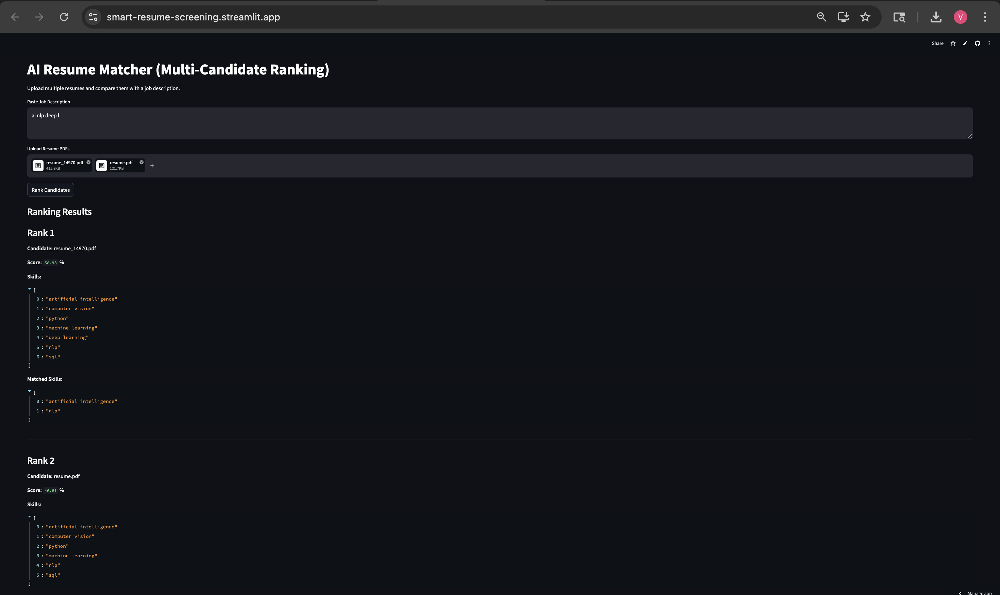

# AI Resume Matcher (Multi-Candidate Ranking System)

An AI-powered resume screening application that compares multiple candidate resumes against a job description and ranks applicants based on semantic relevance and skill matching.

## Live Demo

https://smart-resume-screening.streamlit.app

---

## Features

- Upload multiple resumes in PDF format
- Paste a job description
- Automatic resume text extraction
- NLP preprocessing using spaCy
- Semantic similarity scoring using Sentence-BERT
- Skill extraction using keyword matching
- Candidate ranking from highest to lowest score
- Recruiter-friendly shortlist workflow

---

## Screenshot



---

## How It Works

### Input:
- Multiple resumes (PDF)
- One job description

### Processing:
1. Extract text from resumes
2. Clean and preprocess text
3. Generate embeddings using SentenceTransformer
4. Compute semantic similarity
5. Detect skills in resumes and JD
6. Combine scores

### Output:
- Ranked candidates
- Match scores
- Candidate skills
- Matched skills

---

## Scoring Logic

Final Score =

- 70% Semantic Similarity
- 30% Skill Match Score

This balances contextual relevance and explicit skill overlap.

---

## Tech Stack

- Python
- Streamlit
- spaCy
- Sentence-Transformers
- scikit-learn
- pdfplumber
- pandas
- torch

---

## Use Cases

- Recruiters screening applicants
- HR shortlist automation
- Internal hiring tools
- Resume relevance scoring

---

## How to Run Locally

```bash
pip install -r requirements.txt
streamlit run app.py
```
## Author Note

This project was built to explore practical applications of NLP in recruitment workflows.  
The goal was to create a usable prototype that can help compare multiple resumes against a job description using semantic similarity and skill-based scoring.

It reflects hands-on work in machine learning deployment, text processing, and building end-to-end AI products.

— Vijendra